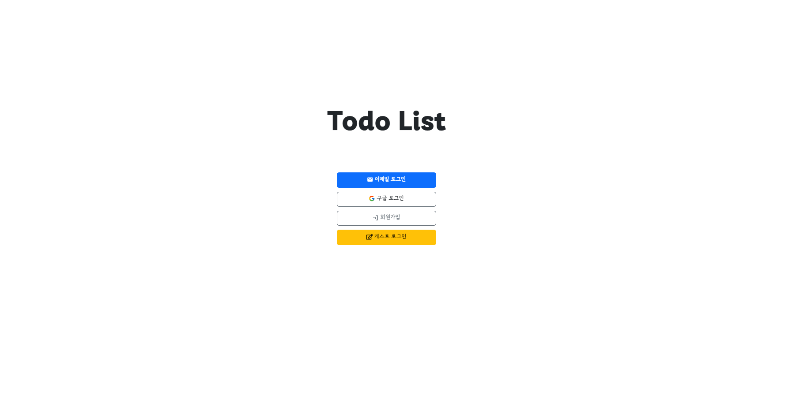

# ✏️ Todo-list 일정관리 프로그램 

## 🌐 [프로젝트 URL](https://web-todolistproject-lzy143lgf0f1c3f8.sel4.cloudtype.app/)
  
## 📌 프로젝트 목적
간단한 일정 관리를 통해 시간 관리 효율성을 높이고, 사용자가 쉽고 빠르게 일정을 관리할 수 있도록 돕는 웹 애플리케이션입니다.

## 📋 프로젝트 개요
1. **사용자 관리 페이지**: 회원가입, 로그인 등 사용자 인증 및 관리
2. **일정 관리 페이지**: 월별 일정표, 할 일 리스트, 스마트 리스트
3. **일정 관리 툴**: 할 일의 진행 상태 체크 기능

## 🛠 사용 언어 및 개발 환경
- **프론트엔드**: React
- **백엔드**: SpringBoot, Spring JPA, RESTful API
- **데이터베이스**: MySQL, mariadb
- **클라우드 서비스**: CloudType
- **개발 툴**: Visual Studio Code, Spring Tool Suite 4, MySQL Workbench, Windows, Github, Gradle, npm

## 💡 주요 기능 및 설명

### 사용자 관리 페이지
1. **회원가입, 로그인**  
   - 스프링부트 시큐리티를 활용한 이메일 로그인 기능 구현  
   - Gmail SMTP를 활용하여 임시 비밀번호 이메일로 보내기 기능 구현
   - Spring Security OAuth2 Google을 활용하여 구글 로그인 기능 구현
   - 서비스를 체험해볼 수 있는 게스트 로그인 기능  
  

### 일정관리 페이지
1. **월별 일정표**
   - 데이터 피커를 활용한 달력 구현
   - 리스트별 색에 따라 다른 색으로 일정 표현
   - 달력에서 새로운 할일을 만들고 작성한 할일 수정가능  
  

2. **목록별 할 일 리스트**
   - 리스트별 할 일을 목록으로 보여줌
   - 리액트 모달을 활용한 간단 할 일 추가 입력창을 통해서 오늘 할 일 추가 기능
   - 목록과 선택한 할 일의 상세사항을 동시에 볼 수 있음  
  

3. **일정에 따라 자동 계산되어 보여지는 스마트 리스트**
   - 일정에 따라 오늘 할 일, 내일 할 일, 다음주 할 일을 산출하여 리스트를 생성
   - 완료 및 취소처리되어 일정표에서 확인할 수 없는 할일의 목록을 볼 수 있음  
  

### 일정 관리 툴
1. **할일의 진행상태 체크**  
   - 체크박스를 활용하여 진행된 할 일을 **완료처리**하여 목록에서 흐리게 혹은 목록 맨 아래로 배치하는 기능  
   - 진행하지 않을 할 일을 **취소처리**하여 목록에서 안보이게 하는 기능  
   - 할 일의 일정에 따라서 **일정이 지난 할 일**과 **아직 도래하지 않은 할 일**을 구분하여 일정이 지났는데 진행하지 못한 일정을 쉽게 확인할 수 있음  
  
1. **할 일의 묶음, 리스트 관리 가능**  
   - 한가지 주제에 대한 여러가지 할 일을 혹은 프로젝트처럼 일정 기간동안 진행하는 일정을 **아이콘**과 **색**으로 다른 일정들과 차별화하여 관리 가능   
   

### 사용자 커스텀 기능
1. 주의 시작 요일 선택 기능
2. 일정의 시간을 12시간제 혹은 24시제 중에 선택 기능
3. 리스트형 일정표를 선택했을때 가장 먼저 나올 대표 리스트 선택 기능
4. 사용하고 싶은 스마트리스트 목록만 선택하여 렌더링 기능    

## 🚀 더 자세한 내용
더욱 자세한 내용 및 소스 코드는 [GitHub 레포지토리](https://github.com/seuunng/ToDoListProject)에서 확인하실 수 있습니다. 프로젝트에 관심을 가져주셔서 감사합니다.
